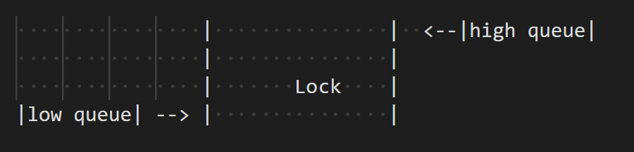

# Problem
https://www.codewars.com/kata/61c1ffd793863e002c1e42b5

You work at a lock situated on a very busy canal. Boats have queued up at both sides of the lock and your managers are asking for an update on how long it's going to take for all the boats to go through the lock.

The inputs are 2 arrays representing the low and high queue, each array contains the list of integers >0 that represent the lengths of the boats, and an integer representing the length of the lock. The output should be an integer representing the time it took for all the boats to go through the lock

# Requirements
* Boats are queuing in order and they must go into the lock in that order
* A boat of length n will take n minutes to enter and n minutes to leave the lock.
* Multiple boats can go into the lock at the same time, however they must not exceed the length of the lock.
* The lock takes 2 minutes to fill and empty each time
* The lock should start and finish at the low end
* No boat will ever be longer than the lock
* The time should be returned in minutes


=Visual representation of a lock=




# Approach

With the requirements above, the program should adhere to the following checks:
* Alternate between the low and high queue.
* The lock must fill when the boat from the low queue enters, and it must empty when it's from the high queue
* The lock must be empty at the end of the process

# Componenent design

## Lock
This class represent the canal's lock

* boolean m_isfull: Whether the lock is full
* int m_length: The length of the lock
* Boat[] m_currentBoats: The boats that are currently in the lock
* s_waterfillTime: The time for the lock to fill the water
* s_waterEmptyTime: The time for the lock to empty the water
* int setCurrentBoats(Boat[] boats) : Set the current boats into the lock and return the time it took to process these boats
* int fill(): Fill the lock and return the time it took
* int empty(): Empty the lock and return the time it took


## BoatQueue
This class represent a single queue of boats

* Boat[] m_boats: The boats currently in the queue
* Boat[] getMaxBoatsToLock(Lock l): Find the max number of boats that can fit in the Lock
* Boat[] removeBoat(n): Remove the first n Boats from the queue
* boolean isEmpty(): Check if the queue is empty

## Boat
This class represents a boat

* int m_length: The length of the boat, and also the time for the boat to enter and leave

## Canal
This class represent the canal, which contains all the logics that deal with the operation of the canal

* Lock m_Lock: The lock
* BoatQueue m_lowQueue: The low queue
* BoatQueue m_highQueue: The high queue
* int process(): Start the process and return the time to process all the queue

# Class interaction

The classes in this design interact with each other as follows:

## Canal
### Interacts with Lock
Canal uses the Lock object to manage the entry and exit of boats. The process() method in Canal will call the fill(), empty(), and setCurrentBoats() methods of Lock to control this process.

### Interacts with BoatQueue 
Canal uses two BoatQueue objects (one for the low queue and one for the high queue). The process() method will check and retrieve boats from these queues by calling the getMaxBoatsToLock(), removeBoat(), and isEmpty() methods.

## Lock
### Interacts with Boat
Lock contains Boat objects in the m_currentBoats array. When boats enter or leave the lock, Lock will update this array and calculate the required time.

## BoatQueue
### Interacts with Boat
BoatQueue contains Boat objects in the m_boats array. When boats need to be moved into the lock, BoatQueue will use the getMaxBoatsToLock() method to find the maximum number of boats that can fit in the lock and the removeBoat() method to remove these boats from the queue.

## Boat
### Interacts with Lock and BoatQueue
Boat is the basic component contained within Lock and BoatQueue. Each boat has a m_length attribute to determine the time it takes to enter and leave the lock.


# Program flow 
The execution point of the program will be in Canal.process(). This is the pseudo code of how it will run:

```
* Set the total time = 0
* While both queues are not all empty:
    * if the lock is empty:
        * Set the queue to process to be the low queue
    else:
        * Set the queue to process to be the high queue

       
    * Find the maximum number of boats from the processing queue that can fit in the lock
    * Remove these boats from the processing queue

    * Calculate the time for each boats to enter, depart, and for the lock to fill (if it's low queue) or empty (if it's high queue)
        * Add these to the total
   
* If the lock is full, empties it and add to the total time
* Return the total time
```
# Testing

Unit Testing for each components' logic
